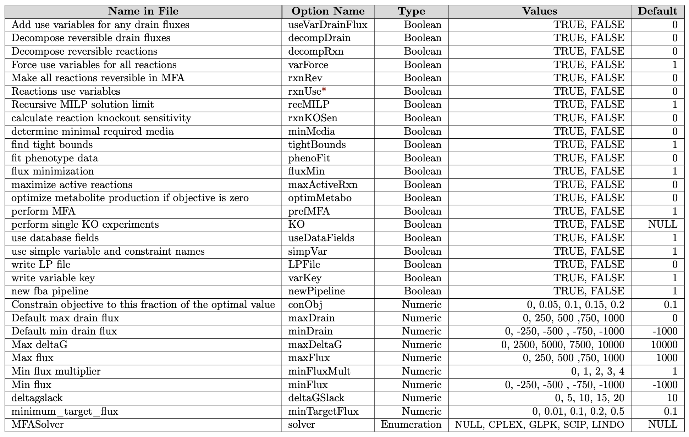

## BLAST
All three configuration models for the BLAST subject for ICO. The initial configuration is in the middle and has 22 configuration options and 76 values in total. The left shows the model for the Distance 2 experiments. We removed any options that caused an error, a warning signaling the option had no effect, or a constraint with the default configuration. This Distance 2 model has 17 configuration options and 58 values. The right shows the model for the covering arrays and the random experiments. We removed parameters that caused an error, timed out, or had a constraint with the default configuration. We also added in three values in order to prevent a constraint marked with the asterisk (note we did not need these in the Distance 2 experiments and they were removed for a warning). This covering array and random model has 19 configuration options and 71 values.

## MFA
MFA Configuration Model. Note since variable types are not explicit we combine Integer and Float to Numeric, for the value of values we stayed consistent with the default. Only the configuration option rxnUse was removed in the D2, D3, Random, and covering array experiments due to timeout.

## SPL Conqueror
Note since variable types are not explicit we combine Integer and Float to Numeric, for the value of values we stayed consistent with the default.

