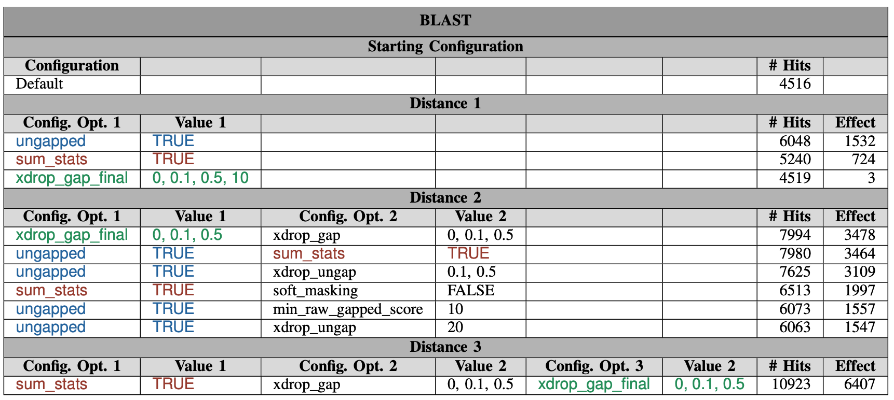
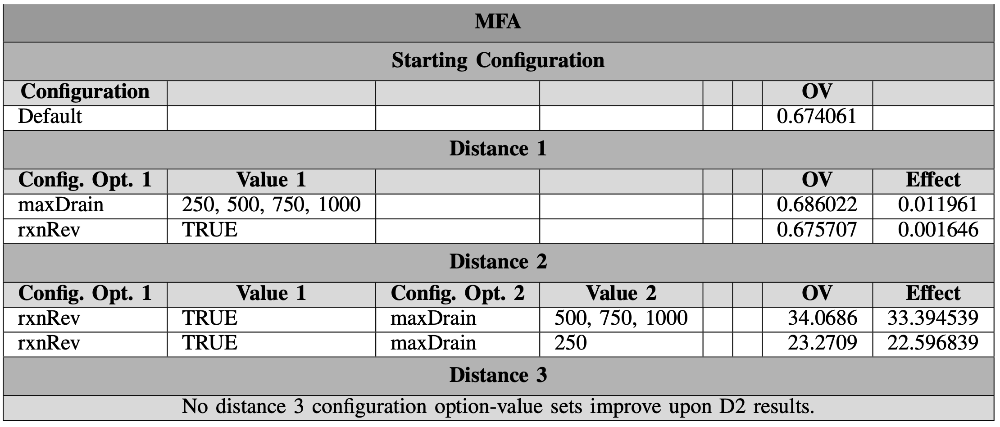
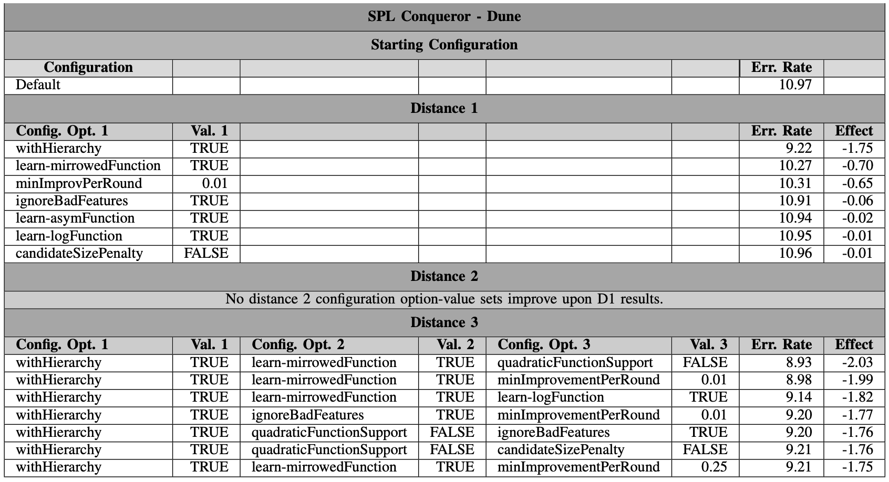
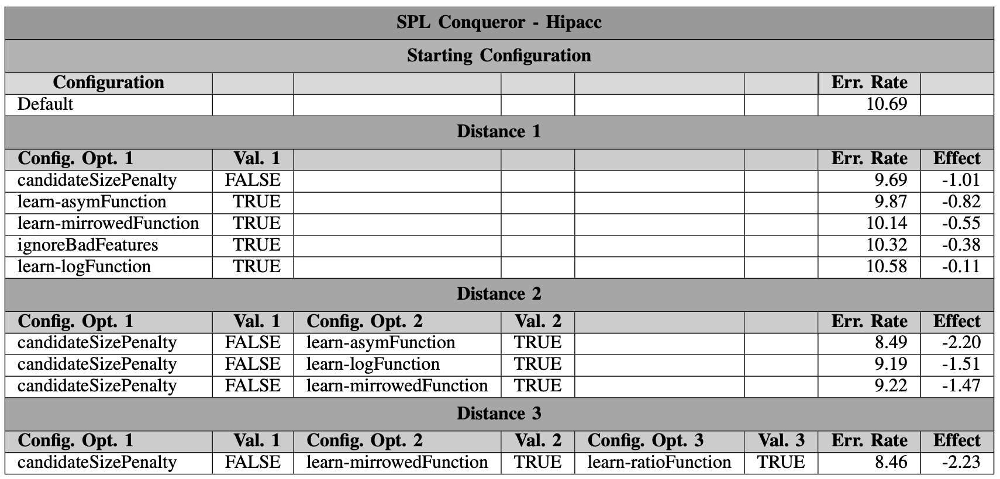
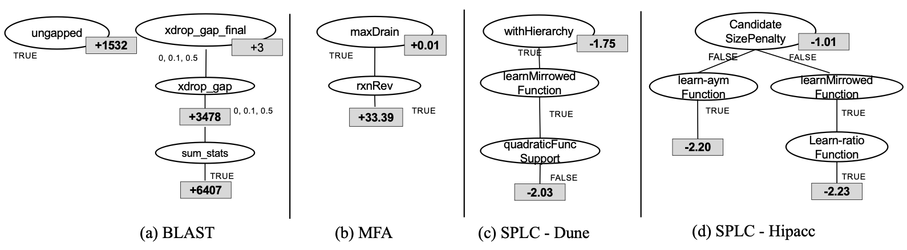
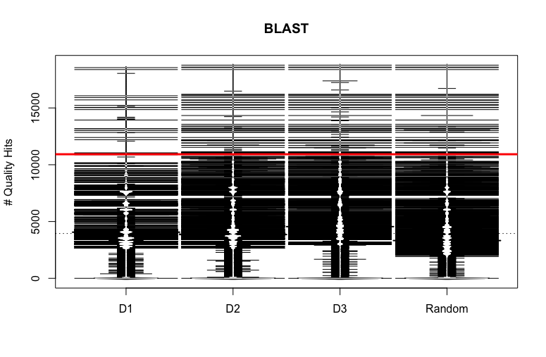
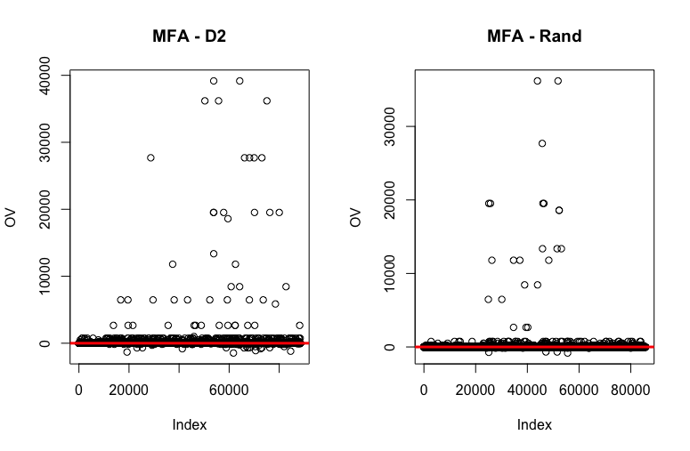
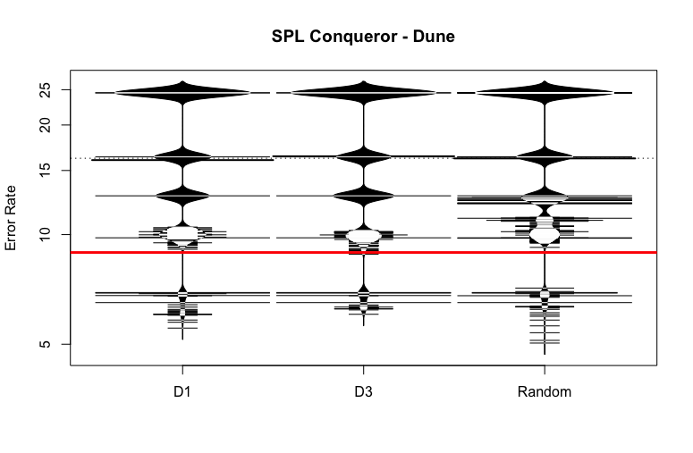
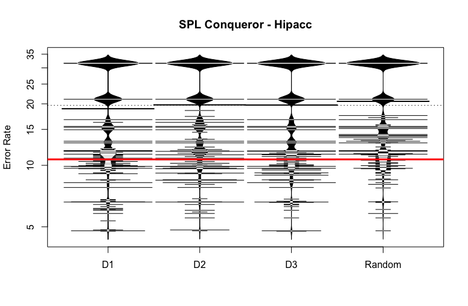

## ICON Outputs
Output tables for all four subjects can be seen below, followed by the output trees.

### BLAST

### MFA

### SPL Conqueror - Dune

### SPL Conqueror - Hipacc

### ICON Trees

## ICON Sensitivity
Sensitivity plots for all four subjects can be seen below.  For MFA the data was so clustered around zero we use a scatter plot.

### BLAST

### MFA

### SPL Conqueror - Dune

### SPL Conqueror - Hipacc

