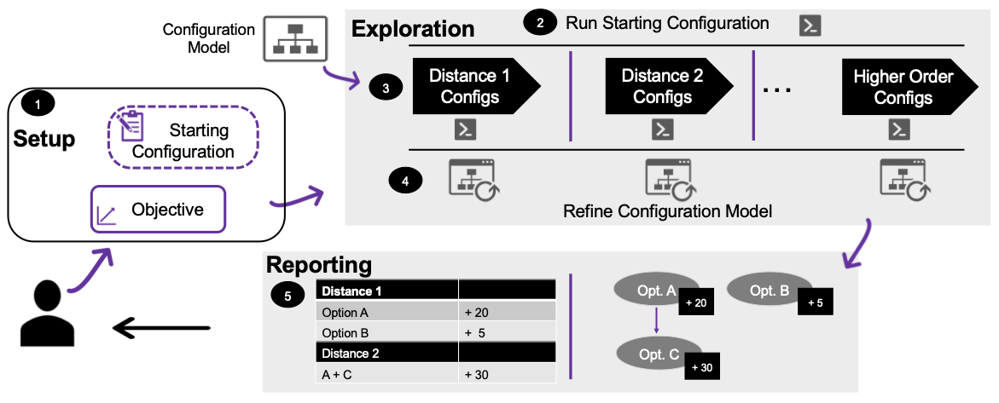
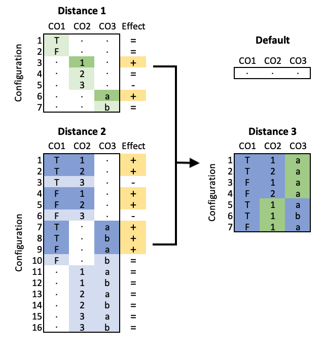

## ICON Framework Details 

**ICON: A Framework for Interpretable Configuration Options**
An overview of ICON can be seen in the Figure below.  ICON consists of three phases: *Setup*, *Exploration* and *Reporting*.  In the Setup phase (#1), the user provides their objective function. This can be any metric (functional or performance) which is measurable and is customizable for their use case. Returning to our motivating example the objective might be *number of hits* or a specific quality metric such as BLAST's `e-value` or `percent identity`. The user can also provide an (optional) *starting configuration*, which defines the specific configuration settings they prefer.  If they do not provide a specific configuration, the default configuration is used.

The next phase is Exploration.  The input to Exploration includes a configuration model.  The configuration model can be provided once for all instantiations of ICON. While it is a necessary part of the process, the user does not need to provide this -- it can be provided by a developer and/or other expert. Exploration starts by running the starting configuration (#2). This is needed to obtain the base objective value which will be used for comparison later on in the algorithm.  Once that is complete, the ICON algorithm (described below) runs iteratively, once for each *Distance*.

We leave the distance parameter out of our figure for simplicity, but it is possible for this to be an input to ICON.  Distance is defined as the *Hamming distance*, which measures how many symbols are different between two words of the same.  Two equal words are distance 0.  For each symbol that differs between the two words, a value of 1 is added. For example `blastn` and `blastn --sum_stats` are distance 1 apart.  We will refer to a configuration distance 1 away from the starting configuration as *D1*, distance 2 as *D2*, and distance 3 as *D3*.  

At each iteration, it is possible that unknown constraints or errors are found for (or between) configuration options. As these are discovered the configuration model can be updated. For instance if a pair of configuration option-values turns out to cause an error at D2, this can be added as a constraint in the model for D3.   Next (#4) we enter the Reporting phase where the user is presented with both a tabular and graphical format of \textit{Positive Effects} found while running ICON. They are given only the configuration options and their values that differ from the starting configuration, and are presented only with positive changes at each distance. A positive change is one that improves over the starting configuration, or over the previous distance.   While ICON records all information (positive, negative, neutral) effects, it only shows the user those changes which provide benefit. If, for instance, there is a positive effect at D1, and at D2 no additional changes improve the user's objective value, nothing will be reported.    We next present the core ICON algorithm (Exploration). 

The figure below shows an example of ICON's core algorithm operaring on a model with 3 configuration options (CO1, CO2, CO3) where CO1 is a Boolean, CO2 is a numeric with options {1,2}, and CO3 is an enumeration types with two options {a,b}.  Note only the highlighted configurations (those that have a positive effect) are combined for Distance 3.

## ICON Outputs
Output tables for all four subjects can be seen below, followed by the output trees.

### BLAST

### MFA

### SPL Conqueror - Dune

### SPL Conqueror - Hipacc

### ICON Trees

