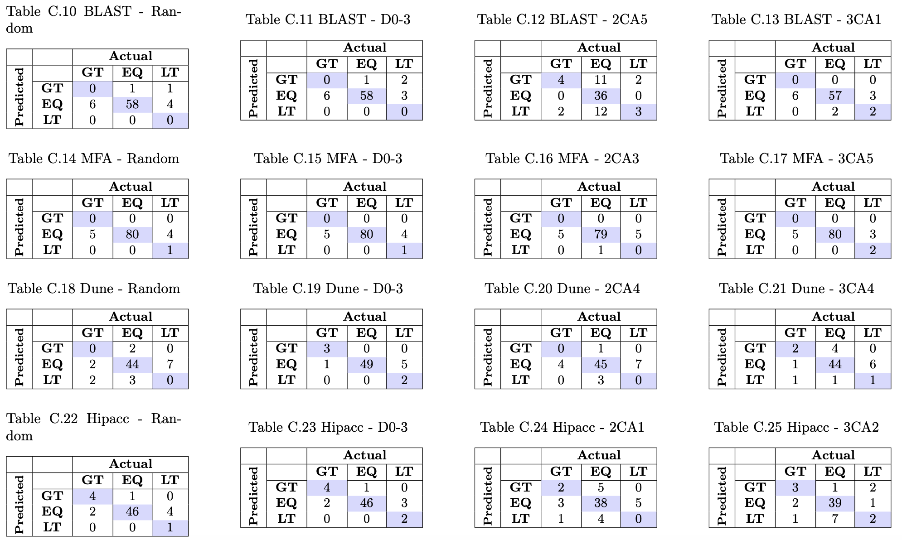
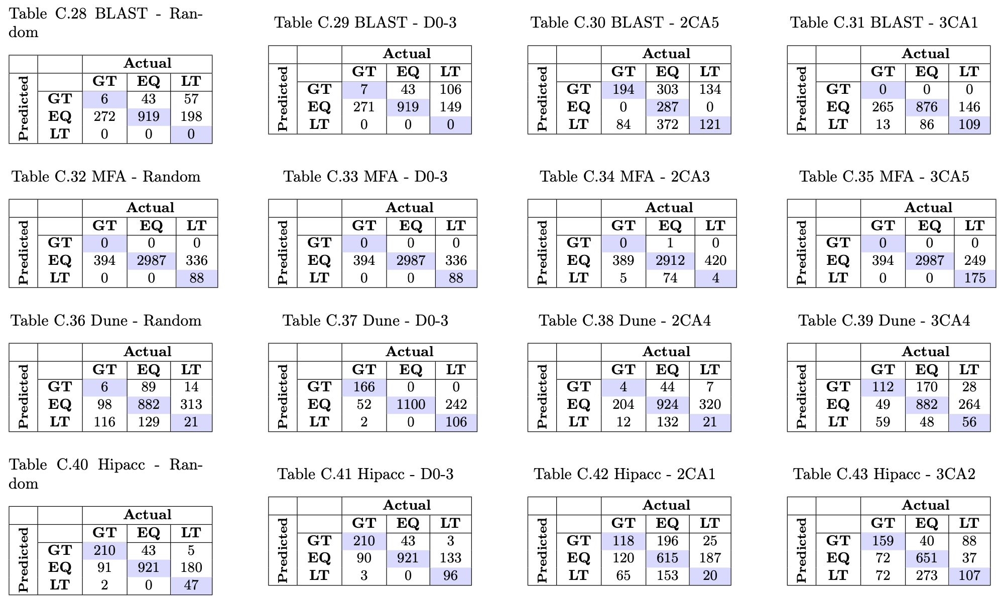

## SPL Conqueror

Since we want to compare the results of SPL Conqueror's prediction method (regression equation) to ICON, we asked if SPL Conqueror can identify the effects of all configuration option-values of distance 1 and distance 2.  To define an *effect*, for each configuration, we classified the output into greater than (GT), less than (LT), or equal to (EQ) the starting configuration. We did this classification for the actual measurements as well as SPL Conqueror predictions to compare.  We utilize confusion matrices for this evaluation

### Distance 1 Confusion Matrices
Confusion Matrices on Distance 1 configurations. Results displayed evaluated on random, D0-3 (distance 0 through 3), best 2-way covering array, and best 3-way covering array.

### Distance 2 Confusion Matrices
Confusion Matrices on Distance 2 configurations. Results displayed evaluated on random, D0-3 (distance 0 through 3), best 2-way covering array, and best 3-way covering array.

